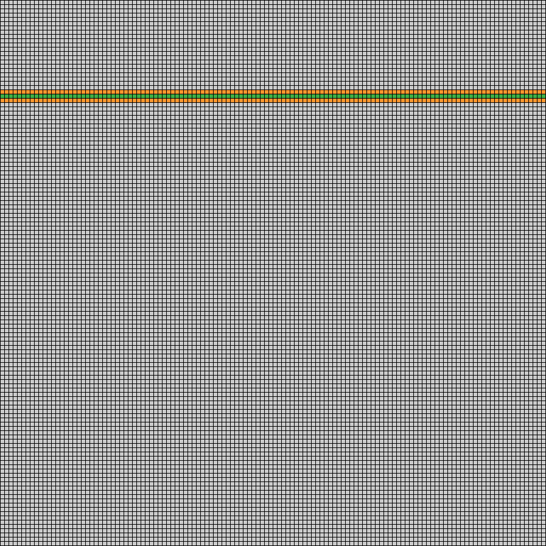

# Compte rendu - PPAR GPU Lab 3 & 4

### Brandon Largeau - Thomas Esseul

## Question 1

On créée une première version de `life_kernel()` :

```C
__global__ void life_kernel(int * source_domain, int * dest_domain, int domain_x, int domain_y)
{
    int tx = blockIdx.x * blockDim.x + threadIdx.x;
    int ty = blockIdx.y * blockDim.y + threadIdx.y;

    if (tx >= domain_x || ty >= domain_y)
    {
        return;
    }

    // Read cell
    int myself = read_cell(source_domain, tx, ty, 0, 0, domain_x, domain_y);

    // TODO: Read the 8 neighbors and count number of blue and red
    int redcells = 0;
    int bluecells = 0;
    int cell;

    for (int line = -1; line < 2; ++line)
    {
        for (int column = -1; column < 2; ++column)
        {
            //Do not read myself
            if (!(line == 0 && column == 0))
            {
                cell = read_cell(source_domain, tx, ty, line, column, domain_x, domain_y);
                
                if (cell == 1)
                {
                    redcells++;
                }
                else if (cell == 2)
                {
                    bluecells++;
                }
            }
        }
    }

    // TODO: Compute new value
    int sum = redcells + bluecells;
    // By default, the cell dies (or stay empty)
    int newvalue = 0;

    if (myself == 0 && sum == 3)
    {
        // New cell
        newvalue = redcells > bluecells ? 1 : 2;
    }
    else if (sum == 2 || sum == 3)
    {
        // Survives
        newvalue = myself;
    }

    // TODO: Write it in dest_domain
    dest_domain[ty * domain_x + tx] = newvalue;
}
```

## Question 2

Actuellement chaque thread fait ``9`` accès en lecture à la mémoire globale, ``myself`` et les ``8`` cases autour. Pour chaque bloc de ``128`` threads, on effectue ``1152`` (``9 * 128``) accès en lecture à la mémoire globale. Pour la totalité des blocs il y a donc ``1152 * 128`` accès, soit ``147456`` au total.

## Question 3

Si on considère qu'on a un bloc de ``128`` threads sur une ligne et en sachant qu'on accède qu'une seule fois à une même case, on peut considérer que le torus ne s'applique plus qu'à la ligne supérieure et inférieure.

Ce qui donne au niveaux des accès, une fois pour chaque case de la ligne courante, une fois pour chaque case de la ligne supérieure et une fois pour chaque case de la ligne inférieure, on a donc ``3 * 128 = 384`` accès pour un bloc de threads.

En vert l'accès ``myself`` des cases sur le bloc de threads courant et en orange les voisins de la case ``myself``.

Ici, les threads d'un bloc (``128`` threads par bloc) sont représentés sur une ligne, donc une dimension et il y a ``128`` blocs de threads.



-------------

Ancienne réponse :

~~Un bloc de 128\*128 threads accède à (128\*128+128\*4+4) cellules de la mémoire globale. Détail du calcul :~~

~~128\*128 : Nombre de cellules du bloc, chacune est lue par ses voisines (en bleu sur le schéma).~~

~~128\*4 + 4 : Les deux colonnes et les deux lignes adjacentes au bloc (en vert foncé sur le schéma). Auxquelles on ajoute les 4 coins ainsi formés (en vert clair sur le schéma).~~

Ancien schéma :


## Question 4

Pour minimiser l'accès unique à une case en lecture, il faudrait des blocs de deux dimensions avec une dimension ``X`` égale à une dimension ``Y``.

Exemple avec ``128``, si on veut avoir une dimension ``X`` et ``Y`` égale, il faudra donc un bloc de dimension ``16 * 16`` pour le plus optimale.

On aurait alors besoin de ``128 + (4 * 16) + 4 = 196`` accès en lecture unique pour un bloc de threads. Les ``128`` du bloc courant (cases vertes), les ``16`` cases par côté des blocs adjacents (cases oranges) et les ``4`` cases des coins (cases rouges).

Ceci n'est pas une représentation des ``128`` blocs, on se focalise sur un bloc de threads donné. J'ai représenté les blocs avec différentes couleurs, vert, gris, bleu et violet. On a sur cette image ``9`` blocs, c'est comme si on avait fait un zoom sur un bloc (bloc vert) au milieu de plein d'autres.


